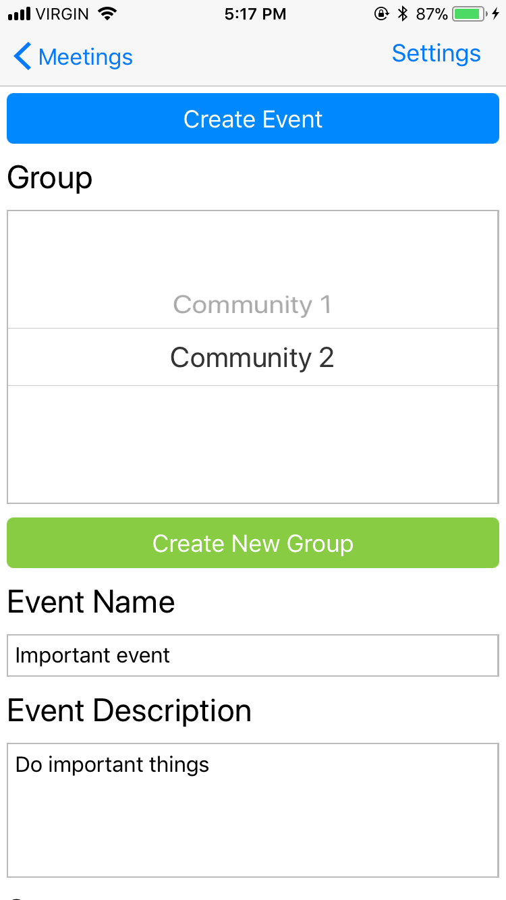

# Connection Resourcess -- an IPhone App

This app was build at the "People Before Profit" hackethon hosted by Vancity.

https://www.vancity.com/AboutVancity/Events/GABVHackathon/

# Screenshots





# Installation

Preinstall

* download nodejs 8 from https://nodejs.org/en/
* extract it
* Add to path: `export PATH=$PATH:$PWD/node-v8.9.4-linux-x64/bin`

* edit 'app/Passport.js' to point at the backend server
* follow frontend / backend steps
* Go to \<backend-ip\>:9090 and create a user having email `myemail@mail.com` (must match Passport.js)

## Frontend

```
npm install -g exp
cd 'app'
npm install
exp start
```

## Backend

```
cd backend
npm install
npm start
```

 

# Attributions
Landing Page Icon CCBY Noun Project
https://thenounproject.com/term/yall/59828

